# SSP 技术架构

> 辽宁社保查询助手 · 2026

本文档是 ssp-web 的**完整架构设计说明**：先用图给出系统的直观结构，再用文字阐述每个
子系统的设计取舍、不变量与边界。前半部分（系统总览 → 数据模型）是**可视化参考**，
后半部分（设计目标 → 已知限制）是**设计叙述**，建议配合源码阅读。

---

## 文档目的与范围

- **是什么**：一个面向公众的“辽宁社保查询助手”。用户用自然语言描述个人情况，系统
  通过 AI Agent 抽取结构化字段、调用**确定性规则引擎**计算社保/退休/补贴方案，并给出
  可追溯的证据链。
- **不是什么**：不是一个让大模型"自由发挥"的问答机器人。所有与金额、年限、资格相关的
  结论都来自规则引擎，LLM 只负责对话编排与信息抽取，**绝不自行计算政策数字**。
- **读者**：维护者、新加入的工程师、做安全/合规审查的同学。

## 设计目标与约束

| 维度 | 目标 | 落地手段 |
|---|---|---|
| **正确性** | 政策结论可复现、可追溯 | 策略即代码（JSONLogic DSL）+ 决策表 + trace[] |
| **确定性** | 同输入同输出，与 LLM 随机性解耦 | 计算全部下沉到纯函数引擎；Agent `temperature=0.1` |
| **可演进** | 政策变更不改代码即可上线 | 规则/参数存 DB，带 `effective_from` 时间线 + 版本 |
| **安全发布** | 错误规则进不了生产 | draft→staging→production 三级门禁（schema + 回归） |
| **可观测** | 每次请求可定位、可计成本 | 结构化日志 + request_id + token/步数埋点 |
| **低成本** | 控制 LLM 调用与延迟 | 稳定 system prompt 前缀（利于服务端缓存）+ 区域就近 |

## 核心设计原则

1. **计算与对话分离**——LLM 负责"听懂"和"编排"，引擎负责"算对"。这条边界是整个系统
   可信度的根基，体现在工具层（`computePlan` 只是引擎的薄封装）与 system prompt 的硬约束里。
2. **策略即代码（Policy as Code）**——仓库只维护辽宁生产规则集使用的 15 条规则定义；决策表、参数包都是数据（DSL JSON），
   不是 `if/else`。政策升级 = 新增一条带新 `effective_from` 的版本，而非改函数。
3. **确定性优先**——引擎是纯函数：`orchestrateInMemory(rules, params, input) → {plan, calc, trace}`，
   不读时钟、不调网络、不依赖全局态。这让回归测试可以离线、可重放（见"确定性与测试策略"）。
4. **门禁而非信任**——发布流水线用 ajv + 完整 JSON-Schema 做结构校验、用**实时重跑**回归
   测试做行为校验，不信任任何"上次跑过的"缓存结果。
5. **可追溯**——每条结论都带 `trace[]`（命中了哪些规则行、用了哪些参数），用户可在证据链
   页面查看，审查者可据此复盘。

## 系统总览

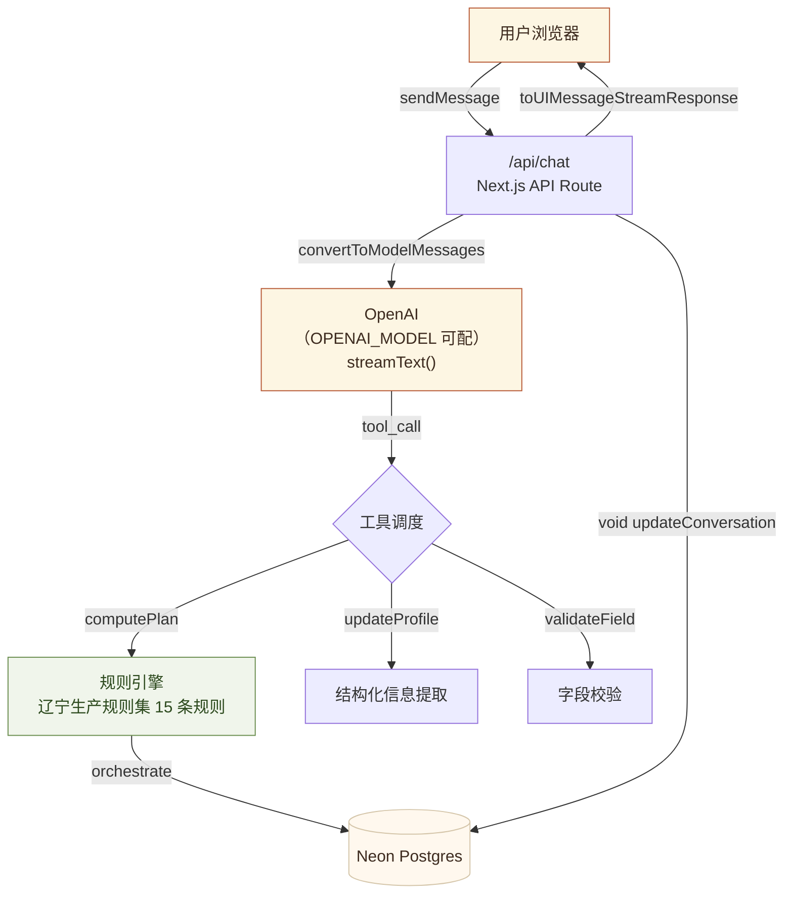

## 四层架构

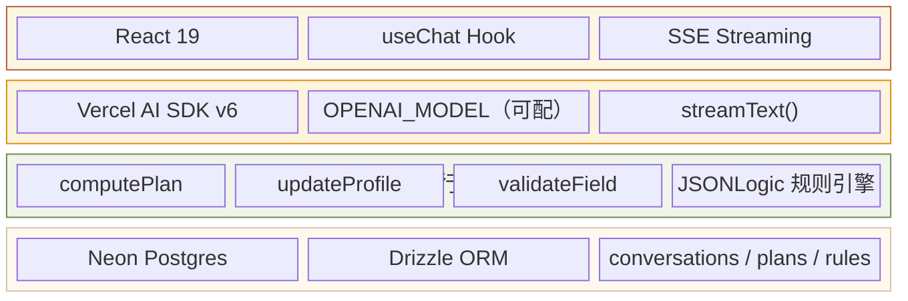

## AI Agent 对话流程

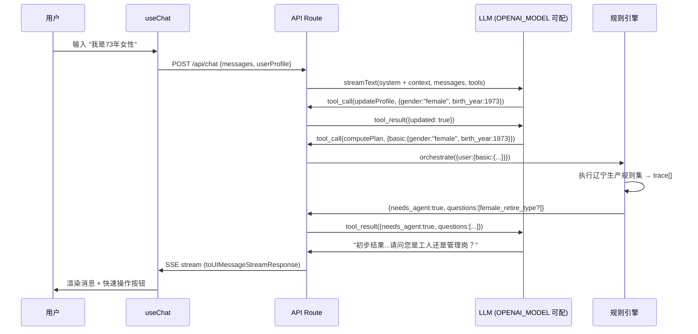

## 规则引擎流水线

```mermaid
flowchart LR
    Input["user{} + params{}"] --> Init["ctx 初始化"]
    Init --> R010["R-010<br/>解析出生年"]
    R010 --> R012["R-012<br/>标准化性别"]
    R012 --> R020["R-020<br/>女性退休类型"]
    R020 --> R110["R-110<br/>查退休年龄表"]
    R110 --> R115["R-115<br/>弹性退休"]
    R115 --> R120["R-120<br/>计算退休日期"]
    R120 --> R200["R-200<br/>养老最低年限"]
    R200 --> R210["R-210<br/>养老缺口"]
    R210 --> More["..."]
    More --> R700["R-700<br/>规划模板"]
    R700 --> R900["R-900<br/>最终安全门"]
    R900 --> Output["plan{} + calc{} + trace[]"]

    style R110 fill:#FEF3DC,stroke:#D4920A,color:#3D2B1F
    style R900 fill:#FDECEA,stroke:#C44536,color:#3D2B1F
```

## 安全结果富化

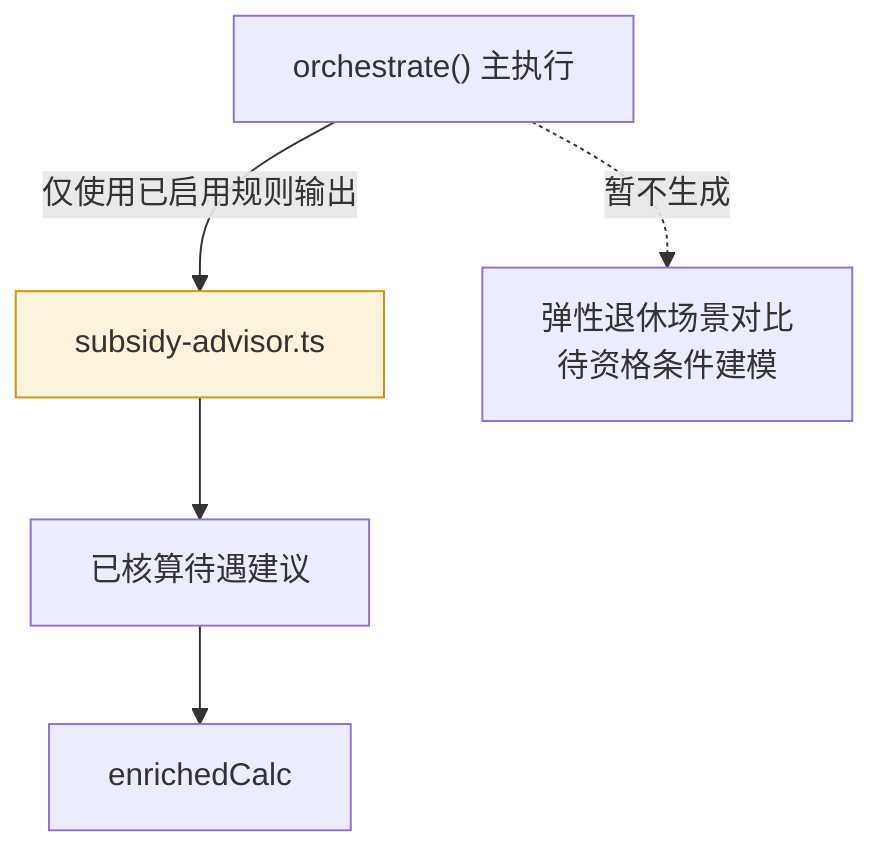

## 工具系统

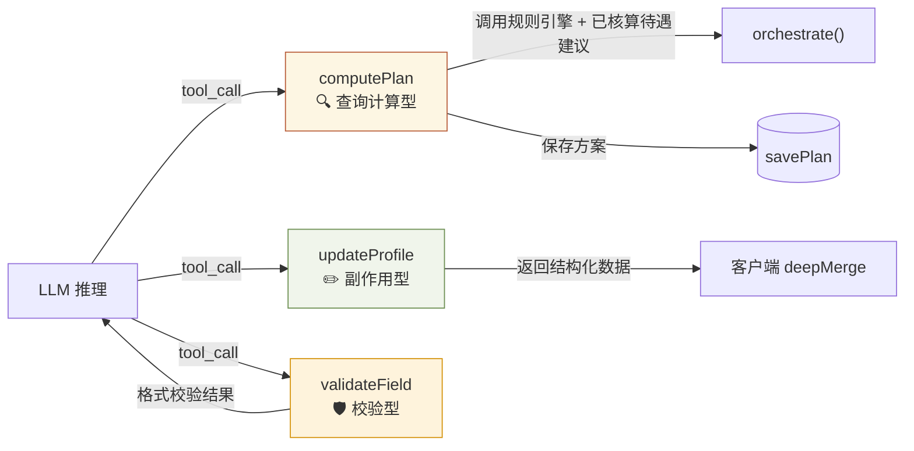

## System Prompt 分层

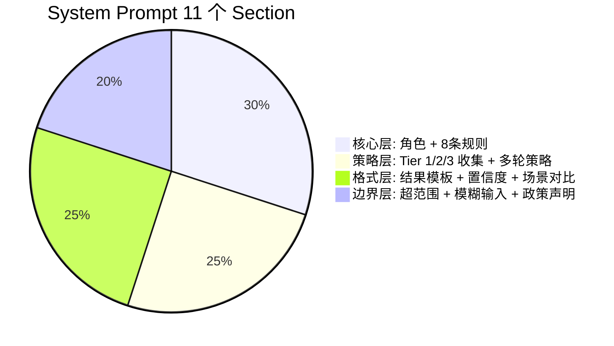

## 会话持久化

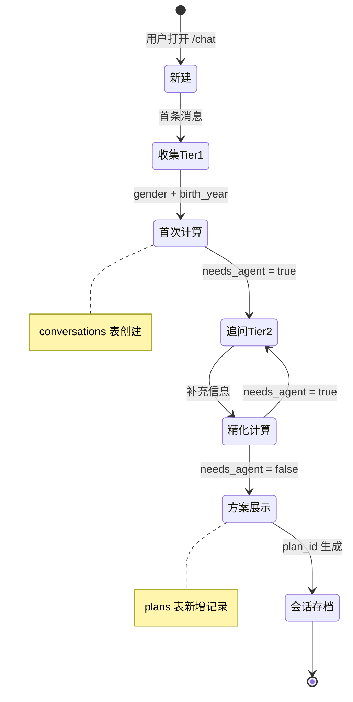

## 消息转换管道

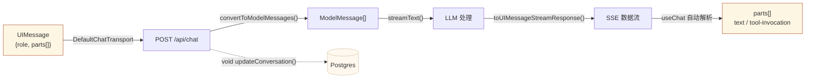

## 安全防御层

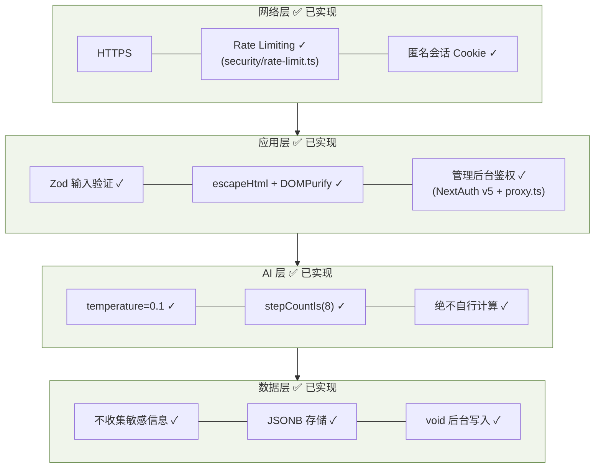

## 可观测性

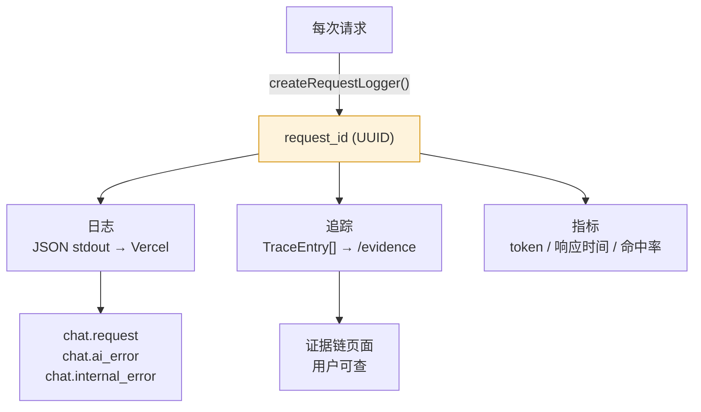

## 数据模型

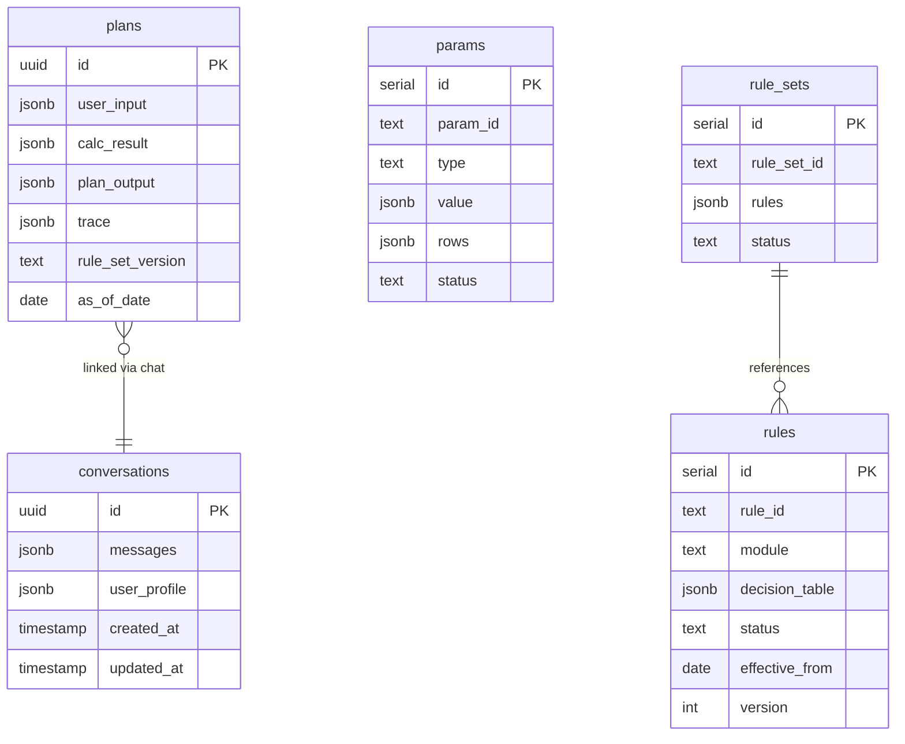

---

# 设计叙述

以下文字部分解释上面各图"为什么这样设计"，以及图里没画到的子系统。

## 运行时与请求生命周期

一次对话请求（`POST /api/chat`，`src/app/api/chat/route.ts`）依次经过：

1. **体积闸**——先看 `content-length`，超过 1 MB 直接 413，避免把超大 body 读进内存。
2. **匿名会话**——`ensureAnonymousSession` 从 cookie 取/发匿名 `sessionId`，用于把方案归属到会话，
   全程不要求登录、不收集 PII。
3. **限流**——`checkRateLimit("chat:<ip>")`，内存滑动窗口（30 次 / 60s）。注意这是**单实例内存**
   限流，多实例/Serverless 扩缩时不共享（见"已知限制"）。
4. **输入校验**——消息条数（≤40）、总字符（≤20k）、单条字符（≤4k），以及结构合法性。
5. **会话装载/创建**——带 `conversationId` 时校验 `sessionId` 归属（防越权读他人会话），否则新建。
6. **快照先写**——流式开始前先把本轮输入写一次 DB，避免流中断导致整轮丢失。
7. **流式生成**——`createChatStream(messages, context)` → `streamText()`，`toUIMessageStreamResponse`
   通过 SSE 回传；`onFinish` 再把最终消息持久化，`onError` 返回可续写的友好兜底文案。
8. **观测埋点**——见"可观测性与成本"。

Agent 定义在 `src/lib/ai/agent.ts`：`stopWhen: stepCountIs(8)` 限制多步工具调用的步数上限，
`temperature: 0.1` 把行为方差压到最低（本 Agent 的职责是确定性的字段抽取 + 工具编排，不需要创造性），
`experimental_context: { sessionId }` 把会话 id 透传给工具的 `execute`。

## 策略即代码与发布流水线

政策不是写死在代码里的，而是三类**数据**，都带 `status`、`version` 和 `effective_from` 时间线：

- **rules**（辽宁生产使用的 15 条定义）——每条是一张 `decision_table`（`hit_policy: first/all` + 若干
  `when/then` 行），动作类型包括 `set` / `call`（调 builtin）/ `lookup`（查参数表）/ `emit_question`
  / `emit_warning`。
- **params**（标量参数 + 表参数）——如缴费基数下限、最低缴费年限时间线表。
- **rule_sets**——把规则编排成一个可发布的集合。

发布走 **draft → staging → production** 三级，门禁在 `src/lib/admin/publish-service.ts`
的 `checkPromoteGates()`：

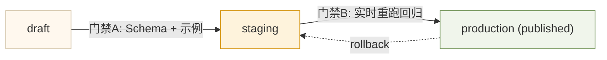

- **门禁 A（draft→staging，仅 rule）**：用 `ajv` + 完整 DSL JSON-Schema
  （`dsl/ssp_dsl_v1/schema/ssp_rule_dsl.schema.json`）做**结构校验**，外加"至少 1 条示例"。
  校验器在 `src/lib/dsl/schema-validator.ts`——它把 DB 的 camelCase 规则行转回 DSL 的
  snake_case 形态再交给 ajv。**设计要点**：项目早就装了 `ajv`/`ajv-formats` 和 schema 文件，
  但此前门禁只做 `ruleId && name && rows>0` 的浅检查，schema 形同虚设；现在畸形规则
  （缺字段、`hit_policy` 非法、行缺 `when/then`）会被真正拦下，错误信息回传给调用方。
- **门禁 B（staging→production）**：取完整政策回归样例，要求至少 1 条，然后**用
  `runDbTestSuite` 将全部 staging 规则、参数及规则集顺序叠加后当场重跑**
  （`src/lib/engine/test-runner.ts`），要求通过率为 100%，且 staging 与 production
  必须由不同复核人操作。
  **设计要点**：旧实现读 `tests.lastRunResult`（可能是几天前、针对旧规则版本跑出来的过期结果），
  等于"自己给自己发通行证"；改为实时重跑后，门禁评估的永远是当前规则 + 当前参数的真实行为。
  两个关键细节：(1) `getEffectiveRules` 只返回 `published` 数据，因此用 staging bundle
  把待发布规则、参数和规则集顺序**整体叠加进有效引擎**，避免拿旧 published 版本充数；
  (2) `loadEffectiveEngine` 按规则集声明顺序排序规则，
  使内存编排与生产 `orchestrate()` 的执行顺序一致（规则输出会喂给后续规则，顺序对结果有意义）。

同样的 ajv 校验也接到了 `POST /api/admin/rules/[ruleId]/validate` 上，让编辑后台即时反馈。

## 确定性与测试策略

引擎是**纯函数**：`orchestrateInMemory(rules, params, input)`（`src/lib/engine/orchestrator.ts`）
不读时钟、不发网络、不依赖可变全局。这让测试可以离线、可重放。测试金字塔：

| 层 | 文件 | 覆盖 |
|---|---|---|
| 单元 | `engine/__tests__/{executor,builtins,calc-extractors}.test.ts` | 执行器、builtin、calc 抽取 |
| 组件 | `components/chat/conversation-runtime.test.ts` | 前端会话运行时 |
| **黄金回归** | `engine/__tests__/golden.test.ts` | 从磁盘 DSL 加载 28 条真实示例，跑全链路断言输出 |

**黄金回归（golden.test.ts）**直接读 `dsl/ssp_dsl_v1/` 下的规则、参数包、示例用例，在内存里
跑 `runTestSuite`，断言每条 hand-authored 示例都能复现其 `expected`。它是真实数据驱动的回归基线：
任何让既有示例输出漂移的改动都会在 CI 红掉。

构建这个测试时暴露了几处**真实信号**，已逐条核对并分类（详见测试内 `KNOWN_DIVERGENCES` 注释）：

- **R-012 性别归一化（已修复）**：规则用 `args.text` 传参，但 `normalize_gender` builtin 只读
  `args.value`，导致该归一化路径**自始失效**（恒返回 `undefined`）。生产里性别通常已在工具层
  归一，故为潜伏 bug；已把 builtin 改为同时接受 `text`/`value`。
- **R-300 医保断缴月数（规则层口径，待办）**：R-300 复用 `date_diff_months`（自然月差，=3），
  但断缴想要"未覆盖整月数"=2，差 1。该 builtin 被 R-120（距退休月数）+ 单测锁定为自然月差，
  **故不改共享逻辑**；正解是 R-300 改用专门的 day-aware 断缴
  函数（需规则变更 + 断缴口径策略确认）。

该偏差登记在测试里——既保持 CI 绿，又能在未来状态变化（新回归或被意外修复）
时强制人工复核。

> **确定性注意事项（已知限制）**：引擎在一次运行中会**就地修改**传入的 rule/param 对象（如对规则
> 排序、在 ctx 上累积 calc）。生产中每个请求都经 `loadEffectiveEngine` 从 DB 加载全新对象，故**单请求
> 内确定性成立**；但若在内存里复用同一组对象重复跑，结果会受上一次运行污染。黄金测试因此**整套只跑
> 一次**。若未来要支持引擎实例复用，需先让 `orchestrateInMemory` 对输入做防御性拷贝。

## 可观测性与成本

每次请求由 `createRequestLogger()`（`src/lib/logging`）生成 `request_id`，所有日志为 JSON 打到
stdout（Vercel 收集），响应头回传 `x-request-id` / `x-conversation-id` 便于端到端定位。chat 路由的
事件谱：

| 事件 | 级别 | 含义 |
|---|---|---|
| `chat.request` | info | 入口，记录消息数 + session |
| `chat.usage` | info | **token 成本**：input/output/total tokens（来自 `result.totalUsage`） |
| `chat.steps` | info | 多步工具调用的**步数**（来自 `result.steps`） |
| `chat.rate_limited` / `chat.body_too_large` / `chat.invalid_json` | warn | 入口防御触发 |
| `chat.persist_*_failed` / `chat.stream_error` | warn | 持久化/流式降级 |
| `chat.ai_error` / `chat.internal_error` | error | 上游/内部错误 |

**成本埋点设计要点**：`totalUsage`/`steps` 只在流式结束后才 settle。直接裸 `.then()` 记录在
serverless 上有风险——响应体一旦关闭，函数可能被冻结，日志丢失。因此用 Next.js 的 `after()`
（`next/server`）把这两条日志注册到响应之后执行，由运行时保证挂起前 flush；既拿到准确的全程 token
计数（用于成本核算与异常用量告警），又**绝不阻塞流式响应**。规则引擎的 `trace[]` 是另一条可观测线：
它进入 `plans` 表并在证据链页面对用户可见。

## Prompt 缓存策略

`createChatStream` 把 system prompt 拼成 `SYSTEM_PROMPT (+ 可选 contextPrompt)`——**稳定的大段
`SYSTEM_PROMPT` 永远在最前缀**，每请求才变化的 `contextPrompt`（引擎问题 + 用户画像）拼在其后。
这正好对齐 OpenAI 的**自动前缀缓存**（按最长公共前缀命中，>1024 token 自动生效，无需配置）：跨请求
复用稳定前缀，省 input token 与首字延迟。

> **维护不变量**：任何"每请求都变"的数据（时间戳、用户输入、随机值）**绝不能插进 `SYSTEM_PROMPT`
> 里**，否则前缀漂移、缓存全失效。新增上下文一律往 `contextPrompt`（后缀）放。`providerOptions.openai.store=false`
> 是为兼容中转网关，不影响前缀缓存。

## CI / CD

`/.github/workflows/ci.yml` 在每个 PR 和 `main` 推送上跑：`npm ci → lint → tsc --noEmit → test → build`，
并发组按分支去重、新提交自动取消旧跑。build 步用占位 env（运行时 env 均惰性读取，构建不需要真实密钥）。

部署到 **Vercel**：区域 `iad1`（靠近 OpenAI / Neon），`/api/chat` 函数超时 120s（多步 + 流式）、
其余 API 30s（见 `vercel.json`）。数据库 schema 用 `drizzle-kit push` 同步（schema-first，无版本化迁移文件）。

## 安全模型

- **网络层**：HTTPS、IP 限流、匿名会话 cookie、请求体大小上限。
- **应用层**：Zod 校验所有工具入参与请求体；后台 XSS 防护（escape + DOMPurify）；管理后台
  走 NextAuth v5 Credentials + 中间件（`proxy.ts`）鉴权；会话读取校验 `sessionId` 归属防越权。
- **AI 层**：`temperature=0.1`、`stepCountIs(8)`、system prompt 硬约束"绝不自行计算政策数字"、
  对用户文本做 `clampPromptText` 收敛（缓解 prompt 注入）。
- **数据层**：不收集敏感个人信息；JSONB 存储；持久化写入以 `void` 后台进行不阻塞响应；密钥只走
  环境变量，绝不入库/入码。

## 数据一致性与迁移

- **schema-first**：唯一事实源是 `src/lib/db/schema.ts`，`drizzle-kit push` 做差异同步。**没有 down
  迁移**，删列/改类型类破坏性变更会直接作用于线上库，执行前需备份。需要可追溯迁移历史时改用
  `drizzle-kit generate` + `migrate`。
- **版本化策略数据**：rules/params/rule_sets 用 `version` + `effective_from` 实现"政策时间线"，
  发布是新增版本而非原地覆盖，配合 `as_of_date` 可复算历史方案。
- **惰性连接**：`db` 是 Proxy，首次访问属性时才建立 Neon 连接（`src/lib/db/index.ts`），因此模块
  导入零副作用，`next build` 与单测都不需要真实 `DATABASE_URL`。

## 技术栈与版本

| 领域 | 选型 |
|---|---|
| 框架 | Next.js 16.2（App Router）+ React 19.2 |
| AI | Vercel AI SDK v6（`streamText` / `tool` / `stepCountIs`）+ `@ai-sdk/openai` v3 |
| 引擎 | `json-logic-js` 2 + 自定义 builtin / 决策表执行器 |
| 校验 | `ajv` 8 + `ajv-formats` 3（DSL JSON-Schema）、`zod` 4（运行时入参） |
| 数据 | Neon Postgres + Drizzle ORM 0.45（`drizzle-kit push`） |
| 认证 | NextAuth v5 |
| 测试 | Vitest 3 | 
| 质量 | ESLint 9 + `tsc --noEmit` |

## 目录结构（关键路径）

```
src/
  app/api/chat/route.ts          对话入口（限流/校验/流式/埋点）
  app/api/admin/…                后台 API（含 rules/[id]/validate）
  lib/ai/{agent,tools,prompts,config}.ts   Agent / 工具 / system prompt / OpenAI 配置
  lib/engine/{orchestrator,executor,builtins,test-runner}.ts   规则引擎
  lib/dsl/schema-validator.ts    ajv + DSL JSON-Schema 校验
  lib/admin/publish-service.ts   发布流水线 + 门禁
  lib/db/{schema,queries,index}.ts   Drizzle schema / 查询 / 惰性连接
dsl/ssp_dsl_v1/                   规则 / 参数 / 规则集 / schema / 示例（事实源）
docs/architecture.md             本文档
.github/workflows/ci.yml         CI
```

## 已知限制与未来工作

- **限流不跨实例**：当前内存滑动窗口在多实例/Serverless 下各算各的，需要硬限流时应换 Redis/KV。
- **引擎输入会被就地修改**：复用引擎实例前需加防御性拷贝（见"确定性注意事项"）。
- **R-300 断缴月数口径**：R-300 复用 `date_diff_months`（自然月差），高算 1 个月；正解是为断缴
  另起 day-aware 函数，需断缴口径策略确认。
- **金额浮点噪声**：补贴/成本估算存在 `1500.0000000000002` 类表示噪声，建议在输出层统一取整。
- **示例与规则版本漂移**：个别 hand-authored 示例（R-200/R-220）引用了旧参数或缺字段，应随规则演进
  校订；黄金测试已把它们登记为已知偏差以防被忽视。
- **param / rule_set 晋升门禁范围**：staging→production 门禁目前只对 `rule` 晋升叠加 staging 版本；
  `param` / `rule_set` 晋升仍只跑 published 规则 + 全量用例，staged 参数值本身未被直接覆盖测试。
- **无版本化数据库迁移**：`drizzle-kit push` 简单但缺审计轨迹，生产规模化后建议切到 generate+migrate。
