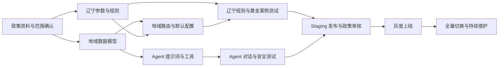

# 辽宁社保 Agent 改造计划

> 项目：SSP Web  
> 改造目标：将现有“上海社保规划 Agent”迁移为“辽宁社保查询与政策解读 Agent”  
> 文档日期：2026-08-17  
> 当前前提：用户端界面已经完成辽宁化，本计划以 Agent、政策数据、规则引擎、测试和发布链路改造为主。

> 实施状态更新（2026-08-18）：本文后续阶段清单保留为迁移历史和验收依据；当前实际状态以第 2 节为准，不应再把原始“待改造”描述当成代码现状。

## 1. 改造目标

在保留现有“LLM 负责理解和编排、规则引擎负责确定性计算”架构的基础上，完成以下目标：

1. Agent 的角色、服务边界、追问方式和结果表达全部切换为辽宁社保口径。
2. 退休、养老、医保、失业保险、灵活就业和就业困难人员补贴等结论只引用已审核的辽宁政策规则与参数。
3. 支持辽宁省级政策与地市差异，避免把沈阳、大连或其他城市政策混为全省统一政策。
4. 所有数值结论可追溯到政策来源、适用地区、生效时间、规则版本和参数版本。
5. 上海规则、参数、案例和默认配置不再进入辽宁生产计算链路。
6. 通过单元测试、典型案例回归、Agent 对话测试和发布门禁后再切换生产流量。

## 2. 当前代码基线与主要差距

### 2.1 已完成部分

- 用户端、Agent 提示词、默认规则集、公开计算 API 已切换为辽宁。
- 已建立 `LIAONING_BASE`、`RS-LIAONING-PLAN-V1` 以及辽宁医保、失业期限规则。
- 辽宁 14 个地市已做白名单校验和“辽宁省沈阳市”一类输入归一化，省外城市不会进入辽宁计算。
- 历史上海 Excel/转录案例已从默认 seed 和展示案例生成链路隔离。
- 未审核的就业困难人员补贴、岗位补贴和弹性退休实际方案不再由结果富化层补造。
- 计算结果区分测算日期与政策资料核验日期，并记录规则集版本、政策包修订标识和参数版本。

### 2.2 待改造部分

| 模块 | 当前状态 | 辽宁化要求 |
| --- | --- | --- |
| 地域模型 | 当前兼容字段仍为 `basic.target_city`，已限制为辽宁 14 地市 | 后续拆分当前参保地、医保待遇地、养老待遇领取地和必要时的户籍地 |
| 地市政策包 | 当前只有辽宁省级基础包 | 按业务优先级建立沈阳、大连等经过审核的城市覆盖包 |
| 金额计算 | 基数、费率、最低工资和补贴参数已建档，但未全部进入生产规则 | 完成地市映射和人工审核后再启用缴费、失业金及补贴金额计算 |
| 案例体系 | 上海历史数据已隔离，辽宁展示案例模板已设审核门槛 | 补充已审核的辽宁案例文件和端到端 Agent 回归集 |
| 数据库 | 采用 schema-first 初始化 | 每个部署环境先执行 `drizzle-kit push`，再导入不含历史上海案例的辽宁种子 |

## 3. 范围定义

### 3.1 本期范围

- 辽宁省企业职工基本养老保险相关查询与退休条件测算。
- 渐进式延迟退休、最低缴费年限等全国统一规则在辽宁场景中的适用。
- 辽宁职工医保退休待遇最低缴费年限、断缴与接续规则；存在地市差异时按地市处理。
- 失业保险领取资格、期限、待遇标准及领取期间社保衔接。
- 灵活就业人员参保、缴费基数、缴费比例和办理提示。
- 就业困难人员社会保险补贴等已核实且可结构化的地方政策。
- 政策结论的来源、地区、生效日期和版本追踪。

### 3.2 暂不自动计算的范围

以下事项在缺少权威、完整且可结构化规则前，只提供材料清单和官方咨询指引，不输出确定性资格或金额：

- 城乡居民养老保险与职工养老保险的复杂衔接、一次性补缴。
- 视同缴费年限、特殊工种、病退、退职和历史档案认定。
- 跨省转移、临时账户及待遇领取地的复杂个案。
- 工伤、生育保险的个案待遇核定。
- 涉及个人完整缴费记录、档案或行政审核裁量的结论。

## 4. 关键设计决策

### 4.1 地域模型

辽宁政策不能只用一个自由文本 `target_city` 表达。建议扩展用户画像：

```text
region.province              固定为“辽宁省”
region.insured_city          当前参保地市
region.benefit_city          预计待遇领取地市
region.hukou_city            户籍地市（仅在规则确实需要时收集）
region.policy_scope          province/city
```

首轮只收集完成当前问题所需的最少地域信息。涉及医保、补贴、办理渠道或地方待遇标准时，必须确认地市；未确认时不得套用沈阳或大连的数值代替全省结果。

### 4.2 政策分层

规则与参数按以下层级组织：

1. `NATIONAL_BASE`：延迟退休、养老最低缴费年限等全国统一口径。
2. `LIAONING_BASE`：辽宁全省统一政策。
3. `LIAONING_<CITY>`：沈阳、大连及其他存在差异的地市覆盖包。

若当前引擎暂不支持政策包继承，本期可以先生成完整的辽宁地市参数包；后续再实现“国家 → 省 → 市”的覆盖合并。无论采用哪种方式，最终计算结果必须记录实际使用的完整参数包 ID。

### 4.3 政策数据要求

每个规则或参数至少保存以下元数据：

- 政策名称、发文机关、文号和官方链接。
- 适用地区、适用人群和排除条件。
- 发布日期、执行日期、失效日期和数据核验日期。
- 原文条款摘要及人工审核人。
- `confidence`：`confirmed`、`needs_review` 或 `unsupported`。

只有 `confirmed` 数据可以进入生产规则集。提示词不得内置可能变化的缴费基数、费率、医保年限、待遇标准或补贴金额，这些数值必须来自 `computePlan` 返回值。

## 5. 分阶段任务清单

### 阶段 0：政策口径确认与资料建档（P0）

目标：先形成可审核的辽宁政策清单，再编写规则，避免直接把上海参数改名后上线。

- [ ] 确认首期覆盖地市：建议至少明确“全省统一部分 + 沈阳”，大连等独立口径按实际业务优先级增加。
- [ ] 建立政策资料台账，记录官方来源、适用地区、生效时间和审核状态。
- [ ] 将现有 24 条规则逐条分类为“全国通用”“辽宁需替换”“地市差异”“辽宁不适用”。
- [ ] 核验养老、医保、失业、灵活就业和就业困难人员补贴五类政策。
- [ ] 明确“4050”是否作为用户俗称保留；规则、页面和证据链使用辽宁官方政策名称。
- [ ] 选取 20～30 个辽宁典型业务案例，由政策人员给出标准答案与依据。

交付物：

- `docs/policies/liaoning-policy-inventory.md`（政策台账）
- 辽宁规则映射表
- 首期支持范围与不支持范围清单
- 已审核的典型案例标准答案

验收标准：所有拟上线政策数值均能定位到有效的官方来源，不使用短视频、论坛或上海案例作为政策依据。

### 阶段 1：数据模型与地域路由（P0）

目标：让系统能够明确“为哪个地区、按哪套政策计算”。

- [ ] 扩展 `UserProfile`、Zod Schema 和 JSON Schema，加入结构化地域字段。
- [ ] 兼容旧会话中的 `basic.target_city`，增加一次性归一化逻辑，避免历史数据直接报错。
- [ ] 新增地域到规则集/政策包的解析函数，禁止在多个 API 中重复硬编码默认 ID。
- [ ] 辽宁范围外的请求返回能力边界说明，不静默使用辽宁参数计算。
- [ ] 在计算结果 `meta` 中增加省、市、政策包版本和核验日期。
- [ ] 对地市信息做白名单校验和标准化，例如“沈阳市”“沈阳”归一为同一代码。

建议新增统一配置：

```text
DEFAULT_PROVINCE=LIAONING
DEFAULT_RULE_SET=RS-LIAONING-PLAN-V1
DEFAULT_POLICY_PACK=LIAONING_BASE
```

验收标准：同一用户选择不同地市时，系统能够确定选择正确政策包；无法确定时明确追问，不进行地方数值计算。

### 阶段 2：辽宁参数包与规则集（P0）

目标：建立独立、可发布、可回滚的辽宁确定性计算链路。

- [ ] 新建 `policy_params_liaoning_base.json`，参数 ID 使用 `P-LN-*`、`T-LN-*`。
- [ ] 按需要新建沈阳、大连等地市覆盖参数包。
- [ ] 新建 `rule_set_liaoning_plan_v1.json`，ID 使用 `RS-LIAONING-PLAN-V1`。
- [ ] 保留真正全国通用的退休规则；将地域参数引用从 `P-SH-*` 改为辽宁/通用命名空间。
- [ ] 重写医保待遇年限、医保断缴等待期、失业保险期限与金额、灵活就业费率及补贴规则。
- [ ] 删除或停用辽宁不适用的规则，不允许仅替换规则名称后继续使用上海判断条件。
- [ ] 更新规则 `evidence`、`notes`、`effective_from` 和示例。
- [ ] 为规则输出增加政策适用地区和依据，供证据链展示。
- [ ] 更新种子脚本，使规则集、参数包和测试数据可重复导入。

重点检查文件：

- `dsl/ssp_dsl_v1/params/`
- `dsl/ssp_dsl_v1/rules/`
- `dsl/ssp_dsl_v1/rule_sets/`
- `dsl/ssp_dsl_v1/rules_manifest.json`
- `src/lib/db/seed/seed-params.ts`
- `src/lib/db/seed/seed-misc.ts`

验收标准：以辽宁默认规则集运行时，trace、参数引用和结果中不再出现 `SHANGHAI_BASE`、`RS-SHANGHAI-*` 或 `P-SH-*`。

### 阶段 3：Agent 提示词与工具改造（P0）

目标：Agent 只负责识别、追问、调用规则和解释结果，不凭模型记忆回答辽宁政策数字。

- [ ] 将角色改为“辽宁社保查询与政策解读助手”，统一产品名称和服务边界。
- [ ] 删除提示词中的上海医保年限、灵活就业费率、补贴比例等硬编码知识。
- [ ] 更新 Tier 字段优先级：问题所需地域、出生信息、性别、参保险种、缴费月数和就业状态。
- [ ] 增加地域追问规则：涉及地方政策但缺少地市时，优先确认参保地或待遇领取地。
- [ ] 更新模糊输入识别，例如“在沈阳交”“准备回大连退休”等多地域表达。
- [ ] 更新超范围策略：辽宁以外政策建议联系当地 12333；复杂历史认定明确转人工或窗口。
- [ ] 扩展 `computePlan` 和 `updateProfile` 工具 Schema，以传递地域与新增业务字段。
- [ ] 强制完整方案展示政策适用地区、数据截至日期和官方核验提示。
- [ ] 当工具失败、无已发布规则或政策过期时，Agent 不输出估算数字，只说明暂无法可靠计算。
- [ ] 更新上下文摘要和客户端画像合并逻辑，确保多轮地域信息不丢失。

重点检查文件：

- `src/lib/ai/prompts.ts`
- `src/lib/ai/tools.ts`
- `src/lib/ai/agent.ts`
- `src/components/chat/conversation-runtime.ts`
- `src/app/api/chat/route.ts`

验收标准：使用提示注入、跨省提问、缺少地市、政策包缺失等测试时，Agent 均不会自行编造政策值或误套上海/其他地市规则。

### 阶段 4：服务层、默认配置与办理建议（P0）

目标：清除运行时对上海配置的隐式依赖。

- [ ] 将 `orchestrator.ts` 的默认规则集和政策包切换为辽宁配置。
- [ ] 将 `/api/plan/compute`、Admin 测试运行、单规则示例运行中的上海默认值改为统一配置解析。
- [ ] 检查 `plan-service.ts` 保存的规则集、政策包与地区元数据是否完整。
- [ ] 重写 `subsidy-advisor.ts` 中的政策名称、办理渠道、材料与行动建议。
- [x] 移除未完成资格条件建模的 `scenario-builder.ts`，避免把退休偏好和未审核补贴金额包装成确定方案；后续需在完整建模后重新设计。
- [ ] 当规则集不存在或没有有效规则时返回显式错误，禁止生成“空计算但看似成功”的方案。
- [ ] 保证历史上海方案仍可按其原版本查看，但不能被辽宁新会话继续复用。

重点排查的现有硬编码入口：

- `src/lib/engine/orchestrator.ts`
- `src/lib/engine/test-runner.ts`
- `src/app/api/plan/compute/route.ts`
- `src/app/api/admin/tests/run/route.ts`
- `src/app/api/admin/rules/[ruleId]/run-example/route.ts`
- `src/lib/engine/subsidy-advisor.ts`

验收标准：生产请求不传规则集和政策包 ID 时，实际加载辽宁配置；日志与方案记录能证明所用版本。

### 阶段 5：辽宁测试体系（P0）

目标：用可重复的测试证明辽宁规则正确，并防止后续政策更新造成回归。

- [ ] 为每条辽宁规则补充正向、边界、缺字段、失效日期和不适用地区测试。
- [ ] 新建辽宁黄金案例测试，不覆盖原上海预期值。
- [ ] 覆盖男女、不同出生年月、不同缴费年限、在职/失业/灵活就业等组合。
- [ ] 对医保和补贴规则按地市分别测试，增加“缺少地市必须追问”用例。
- [ ] 增加 Agent 对话测试：信息抽取、画像合并、更正信息、工具调用顺序和拒绝编造。
- [ ] 增加“上海残留扫描”测试或 CI 检查，辽宁生产文件中出现上海政策标识时阻止发布。
- [ ] 校验规则 trace 中包含正确政策证据、地区和生效日期。
- [ ] 执行 `npm run test`、`npm run lint` 和 `npm run build`。

最低测试门槛：

- 规则单元测试通过率 100%。
- P0 黄金案例通过率 100%。
- 同输入、同地区、同 `as_of_date` 的结果完全一致。
- 所有金额、年限和资格结论均能由 trace 反查规则及参数。
- 辽宁生产链路不存在上海参数 ID 或上海办理指引。

### 阶段 6：案例、文档与运营内容迁移（P1）

目标：避免界面已显示辽宁，但案例、说明或后台内容仍传播上海政策。

- [ ] 隔离 `data/` 下上海转录案例，禁止作为辽宁展示案例或模型上下文。
- [ ] 建立辽宁案例数据集并标注来源、地区、审核状态和适用日期。
- [ ] 更新案例生成脚本中的上海角色与补贴文案。
- [ ] 更新 README、架构文档、DSL README 和 Admin 操作说明。
- [ ] 全局扫描“上海、沪、SHANGHAI、P-SH、T-SH、上海人社 APP”等残留。
- [ ] 对确需保留的历史上海内容放入明确的归档目录，并排除在种子和展示流程之外。

验收标准：用户可见内容、辽宁规则证据和运营案例不存在地区混用；归档上海数据不会被生产加载。

### 阶段 7：发布、灰度与回滚（P0）

目标：在可验证、可观测、可回滚的前提下完成生产切换。

- [ ] 将辽宁参数和规则先发布到 staging，运行全量回归。
- [ ] 由政策人员审核高风险结论：退休时间、医保退休待遇、失业金、补贴资格与金额。
- [ ] 用固定测试账号或内部开关进行小流量灰度。
- [ ] 监控工具失败率、`needs_agent` 比例、无结果比例、地市缺失比例和用户纠错反馈。
- [ ] 抽检线上 trace 与官方口径一致性。
- [ ] 保留上一版本规则集和政策包，验证 Admin 回滚流程。
- [ ] 灰度通过后，将辽宁规则集设为生产默认并停止旧上海链路接收新会话。

回滚条件：

- 发现退休日期、医保年限、待遇金额或补贴资格的系统性错误。
- 生产加载了错误地区参数包。
- trace 无法定位政策依据或版本。
- P0 回归案例在生产版本中失败。

## 6. 建议实施顺序与依赖



建议按两个迭代执行：

- 迭代一（核心可用）：阶段 0～5，完成辽宁单一首发地市的完整闭环。
- 迭代二（生产完善）：阶段 6～7，并逐步增加其他地市政策包。

## 7. 任务优先级汇总

| 优先级 | 任务 | 完成标志 |
| --- | --- | --- |
| P0 | 政策台账与适用范围 | 所有生产数值有官方有效来源 |
| P0 | 地域模型与政策包路由 | 省/市规则不会混用 |
| P0 | 辽宁参数包和规则集 | 独立辽宁链路可计算、可追溯 |
| P0 | Agent 提示词和工具 | 不再依赖模型记忆回答政策数字 |
| P0 | 默认配置与服务链路 | 新会话默认使用辽宁版本 |
| P0 | 回归与安全测试 | P0 用例全部通过 |
| P0 | 灰度、监控和回滚 | 可安全切换生产流量 |
| P1 | 案例库和生成脚本 | 辽宁案例替代上海展示数据 |
| P1 | README 与架构文档 | 项目说明与实际能力一致 |
| P2 | 多地市覆盖与包继承 | 省级基础包支持地市覆盖 |

## 8. 上线验收清单

### 功能验收

- [ ] Agent 自我介绍、追问和结果说明均为辽宁场景。
- [ ] 养老、医保、失业和补贴查询按正确地区调用规则。
- [ ] 缺少必要地市时先追问，不默认套用省会城市政策。
- [ ] 辽宁以外请求不会误用辽宁规则。
- [ ] 用户更正出生信息、性别或地区后，旧值被正确覆盖并重新计算。

### 数据与政策验收

- [ ] 每个生产参数均有官方来源、适用地区、生效时间和审核记录。
- [ ] 已过期参数不会在新的 `as_of_date` 下生效。
- [ ] 结果展示包含适用地区、数据截至日期和必要免责声明。
- [ ] 高风险规则已经过政策人员复核。

### 工程验收

- [ ] 默认规则集为 `RS-LIAONING-PLAN-V1`。
- [ ] 默认政策包为 `LIAONING_BASE` 或明确的辽宁地市包。
- [ ] 辽宁生产 trace 不包含 `SHANGHAI`、`P-SH-*` 或 `T-SH-*`。
- [ ] 测试、Lint 和生产构建全部通过。
- [ ] 发布与回滚流程均在 staging 实际演练成功。

### Agent 安全验收

- [ ] Agent 不自行计算或引用工具未返回的政策数字。
- [ ] 面对提示注入不会忽略地域和规则引擎约束。
- [ ] 无规则、规则过期或工具失败时不会给出伪确定结论。
- [ ] 不主动收集姓名、身份证号、手机号和详细住址等非必要敏感信息。

## 9. 风险与应对

| 风险 | 影响 | 应对措施 |
| --- | --- | --- |
| 辽宁省内地市政策不一致 | 结论套错地区 | 强制结构化地区字段；省、市政策包分层；缺地市先追问 |
| 将上海规则仅改名复用 | 产生实质性错误 | 逐规则政策映射和人工审核；CI 扫描上海参数引用 |
| 政策时效性不足 | 使用过期金额或费率 | 参数版本化、有效期控制、定期核验和过期告警 |
| LLM 使用自身知识回答 | 数值不可追溯 | 删除提示词硬编码；强制只引用工具结果；增加拒绝编造测试 |
| 历史案例污染 | 向用户展示上海经验 | 上海数据归档隔离，辽宁案例必须标注地区和审核状态 |
| 复杂个案被过度自动化 | 用户据此错误办理 | 明确不支持范围，高风险情形转 12333/经办窗口人工核定 |
| 直接覆盖旧数据 | 历史方案无法复盘 | 新建辽宁 ID 和版本，不复用上海政策包 ID；保留只读历史版本 |

## 10. 完成定义（Definition of Done）

只有同时满足以下条件，才视为“辽宁社保 Agent 改造完成”：

1. 辽宁生产请求默认且仅加载经过发布审核的辽宁规则集和政策包。
2. Agent 不包含会变化的地方政策硬编码数字，全部数值来自确定性规则引擎。
3. 地市差异有明确的数据模型、追问策略和政策路由，不以某一城市冒充全省口径。
4. 辽宁黄金案例、边界测试、Agent 安全测试、Lint 和构建全部通过。
5. 每个关键结论均可追溯到适用地区、规则、参数、政策来源和生效日期。
6. 用户可见案例、行动建议和办理渠道均已辽宁化，上海历史数据与生产链路隔离。
7. 已完成 staging 审核、灰度验证和回滚演练，并由业务/政策负责人签字确认。
